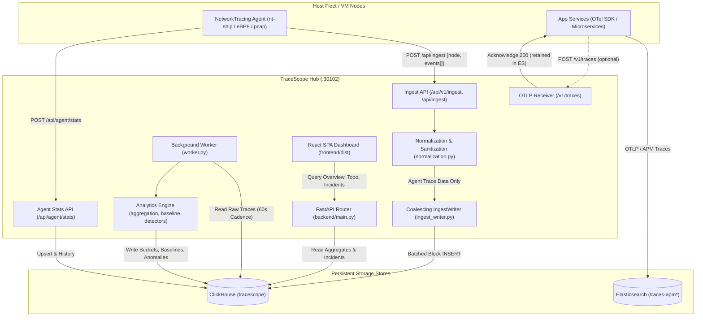

# TraceScope (OTelTrace) — Complete Functional & Architectural Guide

## 1. Executive Summary & System Architecture

**TraceScope** (`~/Viettel/OtelTrace`) is an OpenTelemetry and eBPF/pcap network transaction analytics platform designed for high-throughput, privacy-safe identity attribution, behavior profiling, and anomaly detection across large microservice estates.

### High-Level Architecture & Data Flow

### Storage Isolation Contract
* **Elasticsearch**: Retains full microservice distributed OTel trace graphs (`traces-apm*`).
* **ClickHouse**: Retains host/node **agent trace data** (`src=pcap`, `uprobe`, `ebpf`, `source_probe`, `{node, events}`) and **agent health telemetry** (`agent_stats_latest`, `agent_stats_history`).
* **Bounded Retention**: Enforces automated TTLs across all raw traces (30 days), aggregates (90 days), and ClickHouse internal system logs (3 days for trace/query logs, 7 days for error logs).

---

## 2. Application Entrypoint & Role Routing

### [`backend/app/application.py`](file:///home/ubuntu/Viettel/OtelTrace/backend/app/application.py) & [`backend/main.py`](file:///home/ubuntu/Viettel/OtelTrace/backend/main.py)

#### `create_app(role: str = "all") -> FastAPI`
Constructs and configures the FastAPI application according to the deployed workload role:
- **Roles**:
  - `all`: Full monolithic hub (serves APIs, Ingest, Agent Stats, Internal APIs, and Static Frontend SPA).
  - `api`: Read-only / Query analytics API server for the dashboard.
  - `ingest`: High-throughput write-only edge receiver.
  - `storage`: Internal storage node owning ClickHouse direct connections.
- **Lifespan Context**:
  - Automatically spins up the background `IngestWriter` worker thread on startup.
  - Flushes queued block inserts cleanly on SIGTERM/shutdown.
- **Security Middleware (`authenticate_public_mutations`)**:
  - Validates `X-API-Key` on public state-mutating requests (`POST`, `PUT`, `PATCH`, `DELETE`).
  - Guards `/internal/*` routes with `X-TraceScope-Internal-Token`. Unauthenticated requests receive HTTP 404 (indistinguishable from a non-existent route) to prevent endpoint enumeration.
  - Mounts built React SPA from `frontend/dist` at `/` and `/assets`.

---

## 3. Telemetry Ingestion & Protocol Adapters

### [`backend/app/api/ingest.py`](file:///home/ubuntu/Viettel/OtelTrace/backend/app/api/ingest.py)

#### `ingest_traces(request: Request) -> Dict[str, Any]`
Primary gateway for trace events (`POST /api/v1/ingest`, alias `POST /api/ingest`):
1. **Decompression**: Automatically inspects `Content-Encoding: gzip` or magic bytes (`\x1f\x8b`) and decompresses in-memory (bounded to 40 MB).
2. **Batch Deduplication**: Checks `X-Batch-Id` against ClickHouse `ingest_batches` ledger and memory LRU cache. Returns `{"ok": true, "duplicate": true}` on replays without re-inserting.
3. **Payload Demuxing**:
   - **Agent Envelopes** (`{"node": "...", "events": [...]}`): Extracted directly as agent trace data.
   - **Direct OTLP JSON** (`resourceSpans`): Acknowledged and bypassed if `clickhouse_only_agent_traces=True`.
4. **Agent-Only Filtering**: When `settings.clickhouse_only_agent_traces` is active, evaluates each record via `is_agent_trace()`. Non-agent traces are acknowledged and discarded, protecting ClickHouse from OTel storage bloat.
5. **Submission**: Dispatches valid agent traces into `IngestWriter.submit_async()`.

#### `otlp_v1_traces(request: Request) -> Dict[str, Any]`
Standard OpenTelemetry protocol receiver (`POST /v1/traces`):
- Decodes both Protobuf (`application/x-protobuf`) and JSON (`application/json`).
- If `clickhouse_only_agent_traces=True`, immediately returns `{"partialSuccess": {}}` (HTTP 200) without writing to ClickHouse, recognizing that OTel data is already preserved in Elasticsearch.

#### `elastic_apm_ingest(request: Request) -> Dict[str, Any]`
Elastic APM 7.x compatible receiver (`POST /api/ingest/apm`):
- Decodes Elastic APM transaction/span documents.
- In agent-only mode, returns `{"ok": True, "accepted": 0, "message": "APM traces retained in Elasticsearch"}`.

### [`backend/app/api/agent_stats.py`](file:///home/ubuntu/Viettel/OtelTrace/backend/app/api/agent_stats.py)

#### `post_agent_stats(sample: AgentStatsSample) -> Dict[str, Any]`
Receives Agent Health Protocol v1 telemetry (`POST /api/agent/stats`):
- Validates 16 KiB bounded JSON schema: `schema_version=1`, `type=agent_stats`, `status in {"ok", "degraded"}`.
- Idempotent: rejects duplicate `(node, instance_id, sequence)` combinations.
- Upserts the latest live health record in `agent_stats_latest`.
- Appends historical telemetry in `agent_stats_history` (bounded to 2,880 entries per node with 1-day ClickHouse TTL).

---

## 4. Normalization, Identity Attribution & Privacy

### [`backend/app/services/normalization.py`](file:///home/ubuntu/Viettel/OtelTrace/backend/app/services/normalization.py)

#### `normalize_otel_record(raw: dict[str, Any], source_label: str) -> Optional[NormalizedTrace]`
Transforms heterogeneous incoming payloads (OTel spans, APM hits, pcap events) into a unified `NormalizedTrace`:
1. **Privacy Law (Credentials Scrubbed)**: Extracts usernames from Basic auth headers (`Authorization: Basic dXNlcjpwYXNz`) or WSSE security tokens, and **immediately scrubs** the password from memory. Passwords or raw tokens are never written to ClickHouse or log streams.
2. **Identity Source Resolution**: Sets `identity_source` to `wsse_username`, `basic_auth`, `legacy_agent`, or `anonymous`.
3. **Canonical Operation Normalization**: Strips variable URL IDs (UUIDs, integer IDs) into route templates (e.g. `/api/users/123` -> `api/users/{id}`).
4. **Network & Proxy Attribution**: Resolves client IPs across `X-Forwarded-For` chains, filtering out internal load-balancer proxies (`10.0.0.0/8`, `172.16.0.0/12`, `192.168.0.0/16`).
5. **Agent Identification**: Sets `is_agent_trace=True` if probe attributes (`pcap`, `source_probe`, `node`) are detected.

#### `is_agent_trace(raw: dict[str, Any], envelope_node: Any = None) -> bool`
Authoritative classifier separating agent probe events from external application OTel spans. Checks:
- Explicit node envelope presence (`envelope_node`).
- Probe sources: `src in {"pcap", "uprobe", "tc", "kprobe", "agent", "socket", "ebpf"}`.
- Probe names: `source_probe.startswith(("pcap-", "agent", "ebpf"))`.
- Agent-specific metadata fields.

---

## 5. High-Throughput Coalescing Writer

### [`backend/app/services/ingest_writer.py`](file:///home/ubuntu/Viettel/OtelTrace/backend/app/services/ingest_writer.py)

#### `IngestWriter`
ClickHouse achieves peak ingestion efficiency with large batch inserts rather than individual row writes.
1. **Bounded Admission**: Incoming HTTP requests enter an internal queue bounded by `OTEL_INGEST_QUEUE_CAPACITY` (default 256). If full, requests immediately fail fast with HTTP 429 and `Retry-After: 1`.
2. **Micro-Batching Coalescer**: A dedicated background thread drains up to 50,000 records or 5ms of accumulated requests.
3. **Agent-Only Invariant Enforcement**: Filters any batch entries to ensure non-agent traces cannot be committed to ClickHouse.
4. **Atomic Block Commit**: Executes a single block `INSERT INTO traces` and batch ledger write (`INSERT INTO ingest_batches`).
5. **Caller Wakeup**: Unblocks waiting HTTP handlers only after ClickHouse acknowledges durable commit.

---

## 6. ClickHouse Persistence & Schema Management

### [`backend/app/repositories/clickhouse_migrator.py`](file:///home/ubuntu/Viettel/OtelTrace/backend/app/repositories/clickhouse_migrator.py)

#### `run_clickhouse_migrations(database: Optional[str] = None) -> list[str]`
Applies versioned SQL migrations in `backend/clickhouse_migrations/*.sql` in sorted order:
- `001_initial.sql`: Core tables (`traces`, `anomaly_events`, `metric_buckets`, `services`).
- `002_integrity_and_retention.sql`: Agent stats history TTL (1 day) and UUID generation.
- `003_aggregate_states_shadow.sql`: Pre-aggregated states and 90-day bucket TTL.
- `004_live_table_retention.sql`: 30-day raw trace TTL and 90-day bucket TTL.
- `005_system_telemetry_retention.sql`: **System telemetry TTL policies** (3 days for `text_log`, `query_log`, `processors_profile_log`, `part_log`, `trace_log`, `metric_log`, `asynchronous_metric_log`; 7 days for `error_log`).

#### `configure_system_telemetry_retention(...) -> dict[str, bool]`
Dynamic system retention manager that checks existing system tables and applies retention TTL without requiring server restarts.

#### `truncate_system_logs(...) -> dict[str, bool]`
Emergency maintenance routine that wipes all `system.*_log` tables immediately to free gigabytes of disk space.

### [`backend/app/repositories/db_context.py`](file:///home/ubuntu/Viettel/OtelTrace/backend/app/repositories/db_context.py)
Provides thread-local ClickHouse clients and the SQLite-compatibility adapter:
- `ClickHouseConnection`: Wraps `clickhouse_connect` to provide a standard DB-API cursor interface. Confines SQL dialect translation (e.g. `PRAGMA table_info`, `strftime`, `GROUP_CONCAT`) to the repository boundary.

---

## 7. Analytics, Baseline & Anomaly Detection

### [`backend/app/services/aggregation.py`](file:///home/ubuntu/Viettel/OtelTrace/backend/app/services/aggregation.py)

#### `aggregate_traces(db_path=None) -> dict[str, int]`
Processes raw traces into rolling 1-minute (`60s`) and 5-minute (`300s`) metric buckets:
- Computes request counts, error counts, error rates, and exact p50, p90, p95, p99 latencies using ClickHouse t-digest / quantile states.
- Writes to `metric_buckets` and materialized topology edges (`topology_edges`).

### [`backend/app/services/baseline.py`](file:///home/ubuntu/Viettel/OtelTrace/backend/app/services/baseline.py)

#### `rebuild_baselines(...) -> int`
Constructs non-parametric baseline profiles for service metrics:
- Groups historical performance by `minute_of_week` (0–10079) and `hour_of_day` (0–23).
- Computes rolling **Median** and **MAD (Median Absolute Deviation)** rather than standard deviation, making baselines immune to skew from short-lived outages.

### [`backend/app/services/anomaly_detection.py`](file:///home/ubuntu/Viettel/OtelTrace/backend/app/services/anomaly_detection.py)

#### `detect_revised_anomalies(...) -> list[AnomalyEvent]`
Executes Detectors 1 through 8 against recent metric windows:
1. **Traffic Spike**: Request volume > 3x MAD above baseline.
2. **Traffic Drop**: Sudden uncharacteristic drop in service calls.
3. **Latency Shift**: p95 latency significantly exceeds historical MAD bounds.
4. **Error Rate Increase**: 5xx/error percentage surges past baseline threshold.
5. **New Service Relationship**: First-time observation of caller -> target service edge.
6. **New Principal Relationship**: Identity accessing a service never called before.
7. **New Operation**: Invocation of an unobserved endpoint/method.
8. **Unusual Execution Time**: Traffic occurring outside normal diurnal patterns.

### [`backend/app/services/blast_radius.py`](file:///home/ubuntu/Viettel/OtelTrace/backend/app/services/blast_radius.py) & [`root_cause.py`](file:///home/ubuntu/Viettel/OtelTrace/backend/app/services/root_cause.py)
- Traverses the directed dependency graph recursively to identify all upstream services impacted by a degraded node.
- Pinpoints the root cause service by ranking topological depth and anomaly onset timestamps.

---

## 8. Background Analytics Worker

### [`backend/worker.py`](file:///home/ubuntu/Viettel/OtelTrace/backend/worker.py)

#### `main()` & `run_jobs() -> dict[str, int]`
Standalone background daemon managing periodic analytical stages outside request-serving processes:
- Runs every 60 seconds (managed via `./run_server.sh`).
- Sequential Pipeline:
  1. `aggregate_traces`: Aggregates new raw trace rows into 1m/5m rollups.
  2. `rebuild_baselines`: Recomputes historical medians for active series.
  3. `detect_anomalies`: Evaluates detectors and generates incidents.
  4. `process_principal_intelligence`: Derives identity graph and security changes.
- Emits structured JSON events (`worker_stage_start`, `worker_stage_complete`) with memory tracking (`ru_maxrss` and ClickHouse memory delta).

---

## 9. Operator CLI Tools

### [`backend/cli.py`](file:///home/ubuntu/Viettel/OtelTrace/backend/cli.py)

| Command | Purpose |
| :--- | :--- |
| `python3 -m backend.cli migrate` | Runs all pending ClickHouse schema migrations (`001` to `005`). |
| `python3 -m backend.cli clean-system-logs` | Enforces 3-day/7-day retention TTL on all ClickHouse `system.*_log` tables. |
| `python3 -m backend.cli clean-system-logs --truncate` | Immediately wipes ClickHouse system log tables to reclaim disk space. |
| `python3 -m backend.cli purge-non-agent-traces --dry-run` | Counts how many non-agent OTel traces exist in ClickHouse. |
| `python3 -m backend.cli purge-non-agent-traces` | Purges historical non-agent OTel traces from ClickHouse. |
| `python3 -m backend.cli demo` | Seeds synthetic services and events for dashboard testing. |
| `python3 -m backend.cli analyze` | Runs an immediate one-off pass of the analytical worker stages. |

---

## 10. Frontend Presentation Layer

### `frontend/` (React 19 + TypeScript + Vite)
- Built into static assets at `frontend/dist` and served by FastAPI at port `30102`.
- **Key Modules**:
  - **Overview (`/`)**: Estate-wide RPS, error rate, p95 latency, active incidents, and service health tables.
  - **Topology (`/topology`)**: Interactive HTML5 Canvas graph showing directed dependency edges, traffic weights, and top principals per edge.
  - **Incidents & Anomalies (`/anomalies`)**: Incident drilldown with "WHAT CHANGED COMPARED WITH NORMAL?" explainability cards, blast radius viewer, and operator review actions.
  - **Services (`/services`)**: Service inventory, operation percentiles, caller graphs, and instances.
  - **User Intelligence (`/users`)**: Identity explorer, authentication method breakdowns, and anomaly history.
