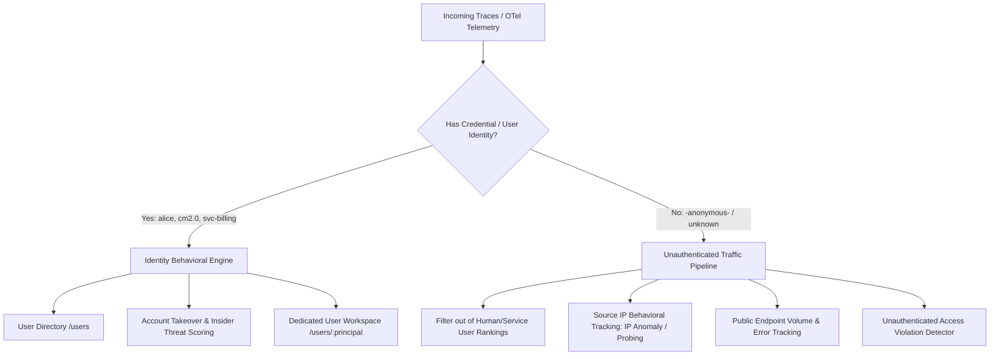

# Kế hoạch Xử lý Thực thể `-anonymous-` (Lưu lượng Chưa Định danh) trong TraceScope

## 1. Hiện trạng & Vấn đề Cốt lõi

### 1.1. Bản chất của `-anonymous-`
- Trong hệ thống phân tích TraceScope, `-anonymous-` (hoặc `unknown`) được gán cho tất cả các transaction **không có thông tin xác thực** (thiếu header `Authorization`, không có token WSSE/JWT, hoặc các lời gọi public).
- `-anonymous-` **không phải là một người dùng thật** hay một account cụ thể, mà là một **nhóm gộp (aggregate bucket)** đại diện cho toàn bộ lưu lượng công cộng của hệ thống.

### 1.2. Các vấn đề khi coi `-anonymous-` là một User bình thường
1. **Làm sai lệch Điểm Rủi ro (Risk Score Distortion)**:
   - `-anonymous-` đến từ hàng trăm địa chỉ IP khác nhau, gọi tới hàng chục service và API khác nhau.
   - Các bộ phát hiện hành vi cá nhân (`NEW_SOURCE_IP`, `SOURCE_FANOUT_SURGE`, `OPERATION_MIX_SHIFT`) sẽ liên tục kích hoạt trên `-anonymous-`.
   - Kết quả: `-anonymous-` luôn bị tính điểm rủi ro cao nhất hệ thống (Risk Score = 100), xuất hiện ở đầu bảng xếp hạng "Top Tài khoản Nguy hiểm", làm che lấp các tài khoản người dùng/dịch vụ thật bị chiếm quyền (Account Takeover).
2. **Ô nhiễm Danh bạ Người dùng (User Directory Pollution)**:
   - Giao diện Quản lý Người dùng (`/users`) hiển thị `-anonymous-` như một tài khoản nhân viên/khách hàng với avatar và thông số tổng hợp hỗn loạn.
3. **Mất giá trị phân tích Incident & Causal Graph**:
   - Gộp tất cả khách vãng lai và bot quét vào chung một thực thể khiến đồ thị nguyên nhân gốc (Root Cause) và phạm vi ảnh hưởng (Blast Radius) không còn phản ánh đúng danh tính.

---

## 2. Giải pháp Kiến trúc Đề xuất: "Tách biệt Thực thể Giả định" (Pseudo-Entity Segregation)

### Nguyên tắc chủ đạo:
> **Không xóa bỏ dữ liệu của `-anonymous-`, nhưng tách rời hoàn toàn khỏi danh mục Định danh Người dùng (Identity Hub) và chuyển trọng tâm giám sát `-anonymous-` sang Địa chỉ IP (Source IP) và Điểm cuối Dịch vụ (Endpoint).**

---

## 3. Kế hoạch Triển khai Chi tiết

### Giai đoạn 1: Chuẩn hóa Mô hình Dữ liệu & Phân loại Thực thể (Data Model & Ingestion)
- **Gán thuộc tính `entity_category`**:
  - Gắn nhãn phân loại rõ ràng cho các principal:
    - `human`: Tài khoản người dùng cá nhân (VD: nhân viên, khách hàng đăng nhập).
    - `service`: Tài khoản máy / service-to-service (VD: `svc-checkout`, `batch-recon`, `cm2.0`).
    - `unauthenticated`: Toàn bộ traffic không xác thực (`-anonymous-`, `unknown`, `""`).
- **Giữ nguyên việc lưu trữ trace**: Không loại bỏ trace `-anonymous-` để đảm bảo thông lượng (TPS) và số liệu latency P95/P99 của dịch vụ luôn chính xác 100%.

### Giai đoạn 2: Tinh chỉnh Behavioral Engine & Incident Scoring
- **Loại trừ `-anonymous-` khỏi Incident Bounded User Scoring**:
  - Trong `backend/app/services/behavioral_engine.py`: Bỏ qua `-anonymous-` khi tính toán các hành vi định danh độc quyền (như `DORMANT_REACTIVATED`, `CALLER_PRINCIPAL_SWITCH`, `SOURCE_FANOUT_SURGE`).
- **Giám sát `-anonymous-` theo Địa chỉ IP (Source IP Centric)**:
  - Nếu `-anonymous-` xuất phát từ một IP cụ thể phát sinh số lượng request đột biến hoặc quét thăm dò $\rightarrow$ Hệ thống cảnh báo trên **IP đó** (`unusual_access` by Source IP hoặc `ip_new_endpoint`).
- **Phát hiện truy cập trái phép vào Endpoint bảo vệ (Unauthenticated Access Violation)**:
  - Nếu `-anonymous-` gọi vào các endpoint yêu cầu xác thực bắt buộc (trả về lỗi 401/403) $\rightarrow$ Đưa vào cảnh báo `auth_failure_burst` gắn với IP nguồn và Target Service, không gắn vào hồ sơ người dùng cá nhân.

### Giai đoạn 3: Cập nhật Backend APIs & Bộ lọc (API & Repositories)
1. **API `/api/v1/users` (User Directory)**:
   - Mặc định: Loại trừ `-anonymous-` khỏi danh sách người dùng (`WHERE principal_name NOT IN ('-anonymous-', 'unknown', '')`).
   - Hỗ trợ tham số query: `include_anonymous=true` nếu người dùng muốn xem lưu lượng chưa xác thực.
2. **API `/api/v1/users/summary` & Overview KPIs**:
   - Tổng số "Active Users" chỉ đếm các tài khoản định danh thực (`human` + `service`).
   - Bổ sung một chỉ số KPI riêng: `unauthenticated_tps` hoặc `anonymous_request_ratio` (% lưu lượng công cộng).
3. **API `/api/v1/user-changes` & `/api/v1/incidents`**:
   - Loại bỏ các thay đổi hành vi nhân tạo của `-anonymous-` khỏi feed sự kiện người dùng.

### Giai đoạn 4: Cập nhật Giao diện Người dùng (Frontend UI)
1. **User Directory (`/users`)**:
   - Danh sách mặc định sạch 100%, chỉ hiển thị các định danh thực tế.
   - Thêm nút Toggle hoặc Filter: `[ ] Hiển thị Lưu lượng Chưa xác thực (-anonymous-)`.
   - Nếu bật `-anonymous-`, hiển thị với huy hiệu đặc biệt màu xám/trung tính: `[Chưa xác thực / Public Traffic]`, không hiển thị điểm rủi ro người dùng gây hiểu nhầm.
2. **Overview Dashboard (`/`)**:
   - Danh sách "Tài khoản Rủi ro Hàng đầu" (Top Risky Accounts) chỉ bao gồm các tài khoản thực cần điều tra.
   - Thêm widget nhỏ: Phân bổ lưu lượng `Authenticated (Đã xác thực) vs Unauthenticated (Công cộng)`.
3. **User Workspace (`/users/-anonymous-`)**:
   - Nếu truy cập trực tiếp vào `/users/-anonymous-`: Hiển thị giao diện "Public & Unauthenticated Traffic Monitor" thay vì hồ sơ cá nhân:
     - Tập trung vào: Biểu đồ thông lượng công cộng, các IP nguồn gửi nhiều request nhất, tỷ lệ phản hồi 2xx/4xx.

---

## 4. Bảng So sánh Trước và Sau khi Áp dụng

| Tiêu chí | Trước khi xử lý | Sau khi áp dụng Kế hoạch |
| :--- | :--- | :--- |
| **Top Tài khoản Rủi ro** | `-anonymous-` luôn đứng đầu với Risk Score 100 | Chỉ hiển thị các user/service thực tế có dấu hiệu bị tấn công |
| **Danh mục Người dùng (`/users`)** | Bị lẫn lộn một "siêu user" `-anonymous-` hàng triệu request | Danh sách định danh chuẩn xác; có tùy chọn bật/tắt lưu lượng public |
| **Cảnh báo Bất thường** | Cảnh báo `-anonymous-` đổi IP, đổi API liên tục (nhiễu) | Cảnh báo tập trung vào IP tấn công hoặc bùng phát lỗi 401/403 |
| **Độ chính xác KPI** | Số lượng user bị lệch (đếm cả khách vãng lai) | Đếm chính xác số người dùng và dịch vụ hoạt động |

---

## 5. Các Bước Thực hiện Đề xuất (Action Items)

1. **Bước 1**: Cập nhật `UserRepository.list_users` và `get_summary` để mặc định loại trừ `-anonymous-` và `unknown` khỏi danh sách người dùng, hỗ trợ tham số `include_anonymous`.
2. **Bước 2**: Trong `behavioral_engine.py`, bỏ qua `-anonymous-` khi chấm điểm `behavior_score` và tạo `incidents` người dùng.
3. **Bước 3**: Bổ sung bộ lọc Toggle `Hiển thị lưu lượng chưa xác thực` trên trang `User Directory` (`frontend/src/pages/user/UserDirectory.tsx`).
4. **Bước 4**: Kiểm thử toàn diện bằng bộ test `pytest` và kiểm tra giao diện thực tế.
